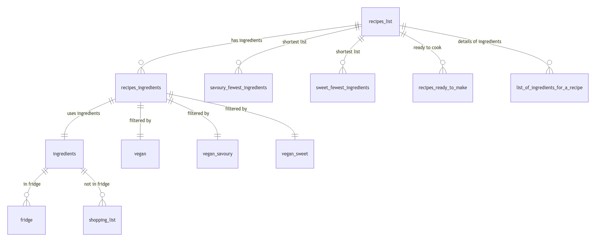

# Design Document

By Anna Zwolińska

Video overview: <https://www.youtube.com/watch?v=dZLHU1qa3hE>

## Scope

Ever found yourself staring at your fridge, wondering what to do with those leftover ingredients? Maybe you tried a new recipe that called for some very specific items, but you only used a small portion, and now you’re left with extras you’re not sure how to use. Been there, got the t-shirt! That’s why I created this database—to help us make the most of leftover ingredients, reduce food waste, and save some $$$ in the process!

 As such, included in the database's scope is:

* a list of ingredients with an overview what is currently in the fridge, categorised into animal derived or not
* a list of recipes categorised into savoury or sweet with a link to each of them
* a list of ingredients and the amount needed for each recipe

Out of scope are elements such as:s
* recipe steps - it was in the initial plans but in order to increase readability it has been removed from the final code and instead there has been added a link to the website with the preparation steps
* nutritional information
* equipment
* additional characteristics of the ingredients
* amounts of the ingredients in the fridge

## Functional Requirements

A user be able to do the following actions with the database:

Update section:
* update and/or upload a csv database file
* add a new ingredient to the list of ingredients
* update your fridge - add an item
* update your fridge: remove an item
* find a recipe you can make with what you already have in your fridge

Overview search (with no input):
* fridge overview: find what ingredients you already have
* find recipes that you can make with what you have in your fridge
* find all recipes / all savoury recipes /all sweet recipes
* find 5 recipes with the fewest ingredients (savoury/sweet)
* find all vegan recipes / all vegan savoury recipes /all vegan sweet recipes [to be improved in the future with more searching options for vegan recipes]

Specific search (with input):
* find a list of ingredients (ID/name search)
* find a list of recipes based on items (name search)
* shopping list for a chosen recipe (ID/name search)

Note that in this iteration, the system will not support additional criteria for vegan recipe search like for example searching for 5 vegan recipes with the fewest ingredients.

## Representation

### Entities

The database includes the following entities:

#### The "ingredients" table includes:
    "id" as INTEGER with a PRIMARY KEY
    "name",
    "in_fridge" as INTEGER with a default value 0,
    "animal_derived" as INTEGER
#### The "recipes_list" table includes:
    "id" as INTEGER with a PRIMARY KEY
    "name" as NOT NULL,
    "savoury_or_sweet",
    "link"
#### The "recipes_ingredients" table includes:
    "id" as INTEGER with a PRIMARY KEY
    "recipe_id",
    "ingredient_id",
    "amount" with a FOREIGN KEY referencing "recipes_list"("id") as "recipe_id")

#### The following views:
* vegan
* vegan_savoury
* vegan_sweet
* savoury_fewest_ingredients
* sweet_fewest_ingredients
* recipes_ready_to_make
* list_of_ingredients_for_a_recipe
* fridge
* shopping_list

### Relationships

The below entity relationship diagram describes the relationships among the tables and the views in the database.

On top of the diagram we can see recipes_list table with a relationship one-to-many with the following views:
savoury_fewest_ingredients
sweet_lewest_ingredient
recipes_ready_to_make
list_of_ingredients_for_a_recipe

and with one table:
recipes_ingredients
which then has has a similar one-to-many relationship with the views below:
vegan
vegan_savoury
vegan_sweet
and with one table:
ingredients
which has a one-to-many relationship with the views:
fridge
shopping_list

## Optimisations

An index has been created on the following columns and tables as they are frequently being used for most of the views and queries.
* "recipe_ingredients_search" on table "recipes_ingredients", columns: "id","recipe_id","ingredient_id"
* "recipe_list_search" on table "recipes_list", columns: "id","name"

## Limitations

With the current schema recipes with optional ingredients or variations might be difficult to represent.
If we decide to use one of the chosen recipes, we can't remove ingredients from the fridge as we don't track amounts of ingredients in the fridge.
Preparation time is not being tracked.
The only no-meat overview is a vegan one, no vegetarian in-between option.

